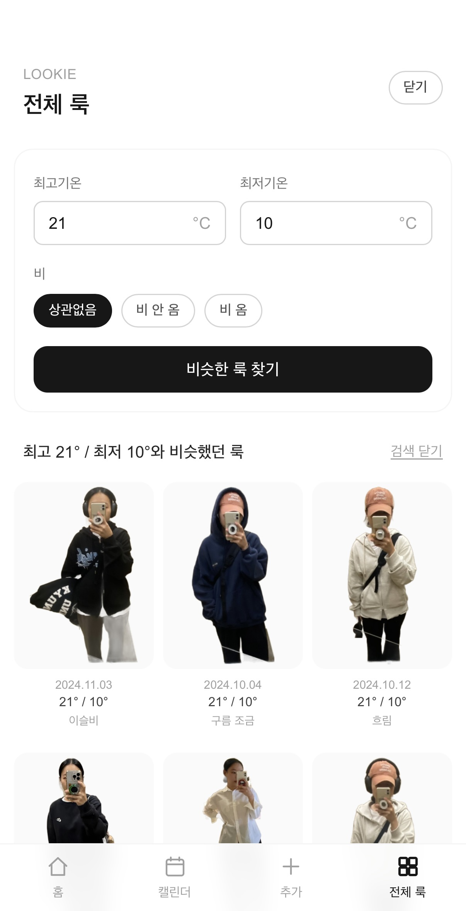

# LOOKIE 👗

> **과거의 나에게서 오늘 입을 옷을 찾는 개인 룩 아카이브**

LOOKIE(룩기)는 전신 거울셀카와 촬영 당시 날씨를 자동으로 연결해 저장하고,
**오늘·이번 주 날씨 또는 직접 입력한 기온과 비슷했던 날 실제로 입었던 룩을 다시 찾아주는 웹앱**입니다.

새로운 코디를 생성하는 대신, 사진첩에 이미 쌓여 있던 실제 착장 기록을 다시 활용하는 데 초점을 맞췄습니다.

---

## 📱 Screens

| Home | Calendar |
| --- | --- |
|  |  |
| 오늘·이번 주 날씨 기반 과거 룩 추천 | 날짜별 누끼 룩 기록 |

| All Looks | Weather Search |
| --- | --- |
|  |  |
| 전체 룩 아카이브 | 최고·최저기온으로 비슷한 룩 검색 |

---

## 💡 Why LOOKIE?

옷을 고를 때 자주 드는 생각이 있었습니다.

> **“이 정도 날씨였을 때 작년에 뭐 입었지?”**

사진첩에는 과거 코디 사진이 많이 있었지만,
비슷한 날씨의 사진을 직접 찾아보고 당시 기온까지 확인하는 것은 번거로웠습니다.

그래서 사진의 **촬영일·위치 메타데이터와 과거 날씨를 자동으로 연결**하고,
원하는 날씨 조건에 맞는 과거 룩을 다시 찾을 수 있도록 LOOKIE를 만들었습니다.

---

## ✨ Main Features

### 📸 사진 일괄 등록

여러 장의 사진을 한 번에 선택하면 각 사진에서 EXIF 정보를 자동으로 추출합니다.

* 촬영일 자동 추출
* GPS 자동 추출
* GPS가 없는 경우 서울 기준 날씨로 fallback
* SHA-256 fingerprint 기반 중복 업로드 방지
* 사진별 독립 처리로 일부 실패가 전체 업로드를 중단하지 않음

---

### 🌤 촬영 당시 날씨 자동 연결

촬영일과 위치를 이용해 Open-Meteo Archive API에서 당시 날씨를 조회합니다.

저장 정보:

* 최고기온
* 최저기온
* 평균기온
* 강수량
* 날씨 상태

일시적인 API 실패에는 자동 retry를 적용하고,
이미 등록된 룩의 날씨만 개별 또는 일괄 재조회할 수도 있습니다.
GPS가 없는 사진은 서울을 기본 위치로 사용하되, 실제 GPS와 fallback 위치를 구분해 저장합니다.

---

### ✂️ 전신 누끼 자동 생성

브라우저에서 직접 배경 제거 모델을 실행해 사진의 배경을 제거하고,
사람을 일정한 2:3 비율로 정규화합니다.

단순한 bounding box 방식에서 끝내지 않고 다음 처리를 추가했습니다.

* Connected Component 분석
* Main Subject 선택
* Opening-by-Reconstruction
* 얇은 난간·손잡이 등 배경 잔여물 제거
* 전신 크기·위치 정규화

자동 결과가 잘못된 경우에는 사용자가 직접 영역을 지정해 누끼를 다시 생성할 수 있습니다.

---

### 📅 Calendar

촬영 날짜를 기준으로 과거 룩을 캘린더에서 확인할 수 있습니다.

* 월별 룩 기록
* 같은 날짜 여러 룩 지원
* 날짜별 누끼 썸네일
* 상세 화면 진입 후에도 기존에 보고 있던 월 유지

---

### ☀️ 오늘·이번 주 날씨 기반 추천

현재 위치의 7일 예보를 좌우로 넘겨보며
각 날짜의 날씨와 비슷했던 과거 룩을 확인할 수 있습니다.

추천은 별도의 생성형 AI 호출 없이
저장된 과거 날씨 데이터를 브라우저에서 직접 비교해 계산합니다.

주요 비교 요소:

* 평균기온
* 최고기온
* 최저기온
* 강수 여부
* 날씨 상태
* 계절 근접도

---

### 🌡 최고·최저기온으로 찾기

원하는 기온을 직접 입력해 과거 룩을 검색할 수 있습니다.

예:

```text
최고 28℃
최저 21℃
```

입력하면 과거 룩 중 해당 기온과 가장 비슷했던 날의 착장을 가까운 순서대로 보여줍니다.
비 여부도 선택적으로 검색 조건에 포함할 수 있습니다.

---

### 🖼 누끼 / 원본 스와이프 상세보기

룩 상세 화면에서는 캐시된 누끼를 먼저 표시합니다.
좌우로 스와이프하면 원본 사진을 확인할 수 있으며,
원본 이미지는 백그라운드에서 미리 로드해 체감 대기 시간을 줄였습니다.

상세 화면에서는 다음 기능도 제공합니다.

* 누끼 수동 수정
* 날씨 다시 조회
* 룩 삭제
* 진입한 화면으로 정확히 복귀

---

### ⚡ Local-first

룩이 많아질수록 Firebase Storage에서 이미지를 매번 가져오는 방식은 느려질 수 있습니다.

LOOKIE는 IndexedDB에 메타데이터와 이미지 Blob을 캐시해:

1. 로컬 데이터를 먼저 렌더링
2. 백그라운드에서 Firestore와 동기화
3. 변경된 데이터만 다시 다운로드

하는 local-first 구조를 사용합니다.

누끼가 수정되면 캐시를 갱신해
홈·캘린더·전체 룩 화면에도 최신 이미지가 바로 반영됩니다.

---

## 🛠 Tech Stack

### Frontend

* Next.js 16
* React 19
* TypeScript
* Tailwind CSS

### Backend

* Firebase Authentication
* Cloud Firestore
* Firebase Storage

### Image Processing

* `@imgly/background-removal`
* Canvas API
* Connected Component Analysis
* Morphological Image Processing

### Data

* `exifr`
* Open-Meteo Archive API
* Open-Meteo Forecast API
* IndexedDB

### Deployment

* Vercel

---

## 🏗 Architecture

```text
Photo Upload
     ↓
EXIF Extraction
 ├─ Date
 └─ GPS
     ↓
Historical Weather
     ↓
Background Removal
     ↓
Mask Cleanup
     ↓
2:3 Cutout Normalization
     ↓
Firebase
 ├─ Firestore Metadata
 └─ Storage Images
     ↓
IndexedDB Local Cache
     ↓
Home / Calendar / All Looks
```

---

## 🔍 Weather Similarity

날씨 추천은 별도의 AI 모델을 사용하지 않습니다.
저장된 각 룩의 날씨와 목표 날씨를 비교해 가중 점수를 계산합니다.

```text
Mean Temperature   35%
Max Temperature    20%
Min Temperature    20%
Rain               15%
Weather Condition   5%
Season Proximity    5%
```

기온 차이는 단순한 구간 분류가 아니라 Gaussian decay를 이용해
차이가 커질수록 유사도가 자연스럽게 감소하도록 구현했습니다.

---

## 📱 Mobile / PWA

LOOKIE는 모바일 사용을 중심으로 설계했습니다.

* iPhone Safari 지원
* PWA standalone mode
* Home Screen 설치 지원
* iOS safe-area 대응
* Touch 기반 crop / swipe UI

---

## Project

**LOOKIE (룩기)**
**Look + Diary**

> 과거의 나에게서 오늘 입을 옷을 찾다.
