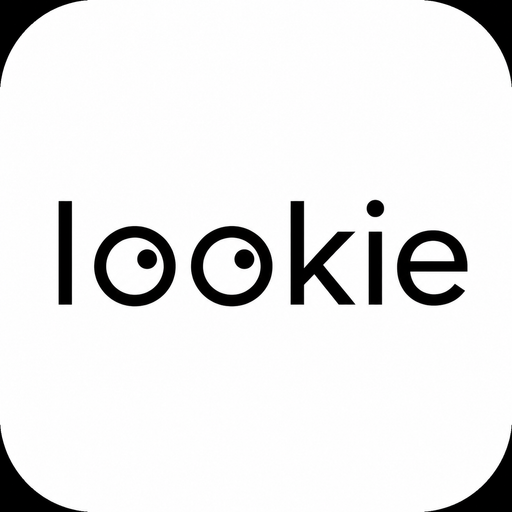
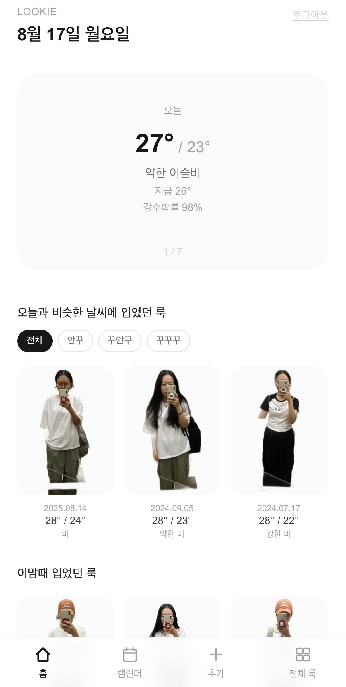
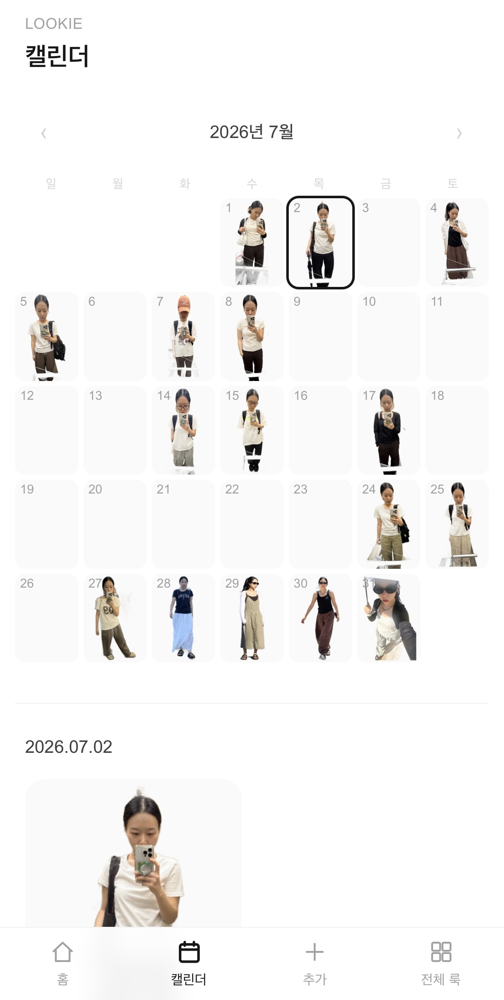
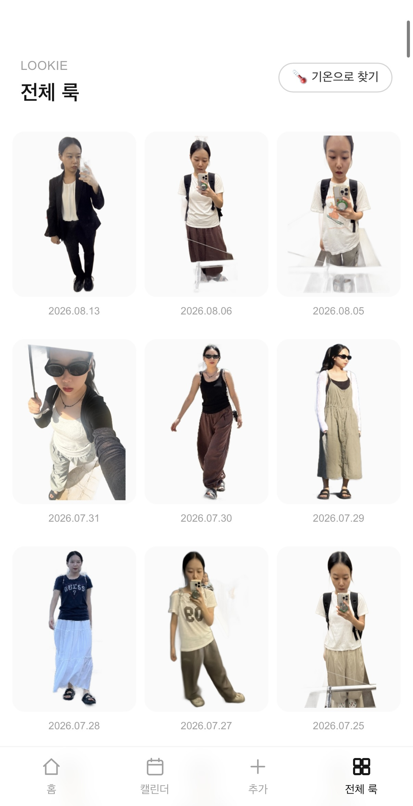
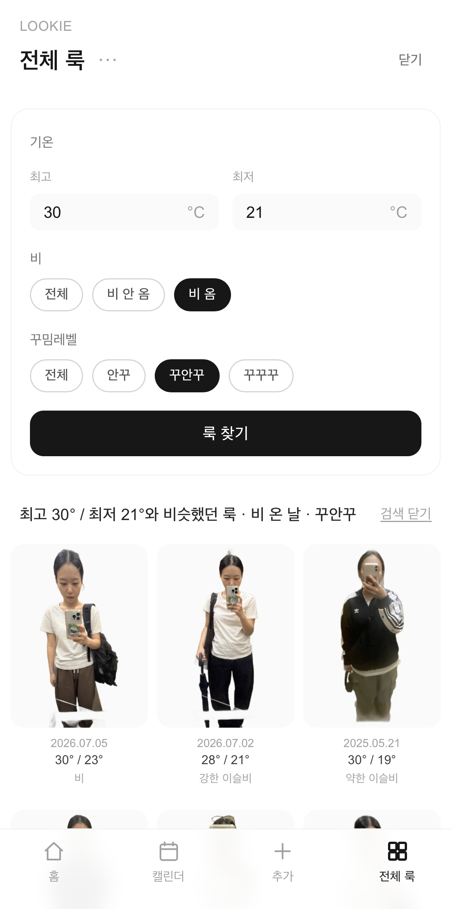
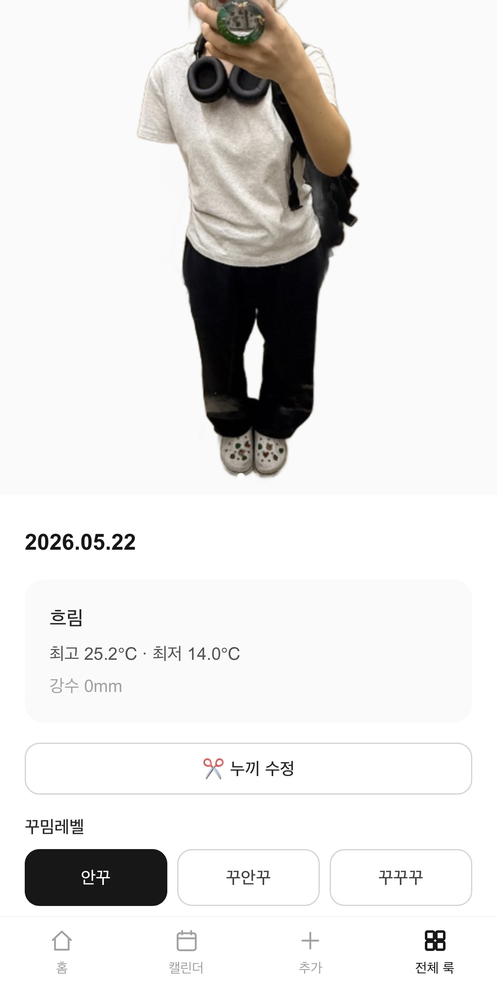
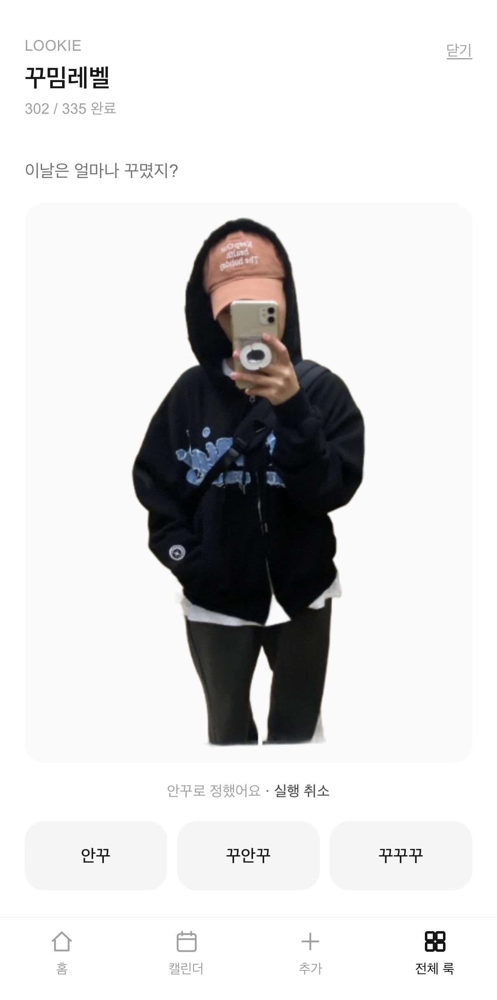

<p align="center">
  
</p>

<h1 align="center">LOOKIE</h1>

> **과거의 나에게서 오늘 입을 옷을 찾는 개인 룩 아카이브**

LOOKIE(룩기)는 전신 거울셀카와 촬영 당시 날씨를 자동으로 연결해 기록하고,
**오늘이나 앞으로의 날씨와 비슷했던 날 실제로 입었던 룩을 다시 찾아주는 웹앱**입니다.

새로운 코디를 생성하는 대신,
사진첩에 이미 쌓여 있는 **내 실제 착장 기록을 다시 활용하는 것**에 초점을 맞췄습니다.

---

## Screens

| Home | Calendar |
| --- | --- |
|  |  |
| 오늘·주간 날씨 기반 과거 룩 추천 | 날짜별로 다시 보는 룩 아카이브 |

| All Looks | Look Search |
| --- | --- |
|  |  |
| 등록한 룩을 한눈에 모아보기 | 기온·비·꾸밈레벨 조건으로 룩 찾기 |

| Look Detail | Dress Level |
| --- | --- |
|  |  |
| 누끼·원본·날씨·꾸밈레벨 확인 | 안꾸·꾸안꾸·꾸꾸꾸 빠른 분류 |

---

## Why LOOKIE?

옷을 고를 때 자주 이런 생각을 했습니다.

> **“이 정도 날씨였을 때 예전에 뭐 입었지?”**

사진첩에는 코디 사진이 많이 쌓여 있었지만,
비슷한 계절의 사진을 다시 찾고 당시 날씨까지 확인하는 과정은 번거로웠습니다.

그래서 사진에 이미 들어 있는 촬영일과 위치 정보를 활용해
**룩과 당시 날씨를 자동으로 연결하고, 필요한 순간 다시 찾을 수 있는 개인 아카이브**를 만들었습니다.

---

## Main Features

### 01. 사진만 고르면 자동으로 기록

여러 장의 사진을 한 번에 선택하면 EXIF 정보를 활용해 룩 기록을 자동으로 생성합니다.

* 촬영일 자동 추출
* GPS 자동 추출
* GPS가 없는 경우 서울 기준 날씨 사용
* 촬영 당시 날씨 자동 조회
* 중복 사진 감지
* 여러 장 일괄 등록

사진마다 날짜와 날씨를 직접 입력하지 않아도 됩니다.

---

### 02. 전신 누끼 자동 생성

사진을 등록하면 브라우저에서 배경 제거를 실행해 전신 누끼를 생성합니다.
누끼는 일정한 비율로 정규화해
캘린더나 전체 룩에서 착장을 쉽게 비교할 수 있도록 했습니다.

난간이나 엘리베이터 손잡이처럼 배경 제거 과정에서 함께 남는 물체를 줄이기 위해
마스크 후처리도 적용했습니다.

자동 결과가 마음에 들지 않으면
원본에서 원하는 영역을 직접 지정해 누끼를 다시 만들 수 있습니다.

---

### 03. 오늘과 비슷한 날씨의 과거 룩 추천

홈에서는 오늘부터 7일간의 날씨를 확인할 수 있습니다.

날짜를 좌우로 넘기면 선택한 날의:

* 평균기온
* 최고기온
* 최저기온
* 강수 여부
* 날씨 상태
* 계절

을 과거 룩의 날씨와 비교해
**비슷한 날씨에 실제로 입었던 룩**을 추천합니다.

새로운 코디를 생성하는 것이 아니라,
내가 과거에 실제로 입었던 기록을 다시 찾아주는 방식입니다.

---

### 04. 꾸밈레벨로 추천 필터링

날씨 추천 결과는 사용자가 직접 정한 꾸밈레벨로 필터링할 수 있습니다.

* 안꾸
* 꾸안꾸
* 꾸꾸꾸

예를 들어 오늘 날씨와 비슷했던 날 중에서도
**꾸꾸꾸로 입었던 룩만 따로 확인**할 수 있습니다.

---

### 05. 이맘때 입었던 룩

현재 날짜와 비슷한 시기의 과거 룩도 홈에서 함께 보여줍니다.
날씨 조건과는 별개로
예전 같은 계절의 착장을 자연스럽게 다시 발견할 수 있습니다.

---

### 06. 룩 찾기

전체 룩에서는 원하는 조건을 직접 조합해 과거 착장을 찾을 수 있습니다.

검색 조건:

* 최고기온
* 최저기온
* 비 여부
* 꾸밈레벨

조건은 필요한 것만 선택할 수 있습니다.

예:

```text
꾸꾸꾸
```

→ 꾸꾸꾸 룩만 최신순으로 보기

```text
비 옴 + 꾸안꾸
```

→ 비 오는 날 입었던 꾸안꾸 룩만 보기

```text
최고 28℃ / 최저 21℃ + 꾸꾸꾸
```

→ 해당 기온과 비슷했던 꾸꾸꾸 룩을 가까운 순으로 보기

검색 결과에서 상세 화면을 열었다가 돌아와도
기존 검색 조건은 그대로 유지됩니다.

---

### 07. 꾸밈레벨 빠른 분류

룩마다 사용자의 기준에 따라 세 단계의 꾸밈레벨을 지정할 수 있습니다.

* **안꾸**
* **꾸안꾸**
* **꾸꾸꾸**

아직 분류하지 않은 룩만 최신순으로 보여주고,
버튼을 누르면 즉시 저장된 뒤 다음 룩으로 넘어갑니다.

직전 선택은 Undo할 수 있으며,
상세 화면에서도 언제든 다시 변경할 수 있습니다.

---

### 08. 캘린더

촬영 날짜를 기준으로 룩을 월별 캘린더에서 확인할 수 있습니다.

* 날짜별 누끼 표시
* 같은 날 여러 룩 지원
* 월별 탐색
* 상세 화면을 보고 돌아와도 보던 월 유지

사진첩처럼 원본 이미지 전체를 보는 대신
착장 중심으로 과거 기록을 빠르게 훑을 수 있습니다.

---

### 09. 전체 룩

등록한 모든 룩을 누끼 중심의 그리드로 볼 수 있습니다.
배경보다 옷차림 자체가 먼저 보이게 구성해
많은 룩을 빠르게 비교할 수 있습니다.

---

### 10. 누끼와 원본 스와이프

상세 화면에서는 누끼를 먼저 보여주고,
옆으로 넘기면 원본 사진을 확인할 수 있습니다.

상세 화면에서는:

* 꾸밈레벨 변경
* 누끼 수정
* 날씨 다시 조회
* 룩 삭제

도 가능합니다.

---

### 11. 날씨 정보 복구

네트워크 오류 등으로 과거 날씨 조회가 실패해도
사진을 다시 등록할 필요가 없습니다.

* 개별 룩 날씨 재조회
* 날씨가 없는 룩 자동 탐지
* 누락 날씨 일괄 복구

를 지원합니다.

---

### 12. Local-first

사진이 많아져도 매번 서버에서 모든 이미지를 다시 내려받지 않도록
IndexedDB 기반 local-first 구조를 적용했습니다.

```text
IndexedDB Cache
      ↓
화면 먼저 표시
      ↓
Firestore와 백그라운드 동기화
      ↓
변경된 데이터만 갱신
```

날씨나 꾸밈레벨 같은 메타데이터만 바뀐 경우
이미지까지 다시 다운로드하지 않습니다.

---

## Weather Similarity

날씨 기반 추천은 별도의 생성형 AI 요청 없이
과거 날씨와 예보 데이터를 직접 비교해 계산합니다.

```text
평균기온       35%
최고기온       20%
최저기온       20%
강수 여부      15%
날씨 상태       5%
계절 근접도     5%
```

기온 차이는 Gaussian decay 방식으로 반영해
차이가 커질수록 유사도가 자연스럽게 낮아지도록 했습니다.

꾸밈레벨을 선택한 경우에는
먼저 해당 레벨의 룩만 추린 뒤 같은 날씨 유사도 계산을 적용합니다.

---

## Tech Stack

### Frontend

* Next.js
* React
* TypeScript
* Tailwind CSS

### Backend

* Firebase Authentication
* Cloud Firestore
* Firebase Storage

### Image Processing

* `@imgly/background-removal`
* Canvas API
* Connected Component Analysis
* Morphological Image Processing

### Data

* `exifr`
* Open-Meteo Archive API
* Open-Meteo Forecast API
* IndexedDB

### Deployment

* Vercel

---

## Architecture

```text
Photo Upload
     ↓
EXIF Extraction
 ├─ Date
 └─ GPS
     ↓
Historical Weather
     ↓
Background Removal
     ↓
Mask Cleanup
     ↓
2:3 Cutout Normalization
     ↓
Firebase
 ├─ Firestore Metadata
 └─ Storage Images
     ↓
IndexedDB Local Cache
     ↓
Home / Calendar / All Looks / Search
```

---

## Mobile / PWA

LOOKIE는 iPhone 사용을 중심으로 만든 PWA입니다.

* iPhone Safari 대응
* 홈 화면 추가
* standalone mode
* 전용 앱 아이콘
* iOS safe-area 대응
* 터치 기반 누끼 수정
* Swipe 기반 날씨·이미지 탐색

Safari에서 홈 화면에 추가하면 일반 앱처럼 사용할 수 있습니다.

---

## 룩기(LOOKIE)

**룩(Look) + 일기(Diary)**

> **과거의 나에게서 오늘 입을 옷을 찾다.**
